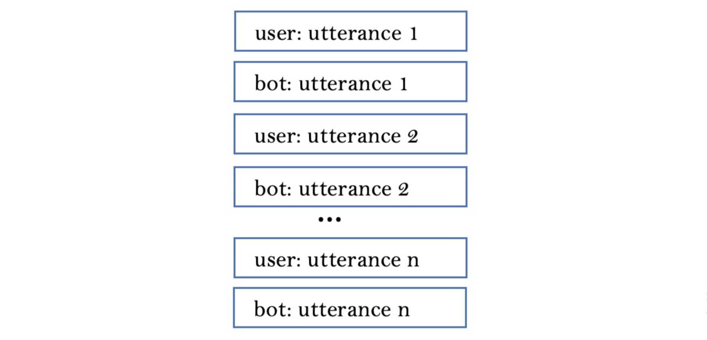

# 基于 GPT2 的对话生成模型 GPT-2 based Dialogue Generation

&emsp;&emsp;随着 ChatGPT 的大火，基于生成式预训练大模型的对话系统也受到越来越多的关注。ChatGPT 实现成本较高，不过我们也可以在其前身的 GPT 系列上简单实现一个对话模型，GPT2 在模型参数量和性能上均是个不错的选择，本文将演示下基于 GPT2 实现对话模型的过程，也可供相关科研工作搭建 baseline 的同学参考。
关于 Transformer 和 GPT 系列的基础知识不作赘述，网上相关参考资料不胜其数，但是关于具体实现的参考教程却并不多见，因此本文结合作者相关的实验步骤作基础分享。

#### 文本生成模型
&emsp;&emsp;对话生成属于文本生成任务，目标是在给定一段文本的前提下预测下一个可能的单词，用数学模型表示就是给定当前文本预测下一个词的概率 $P(w_n|w_1, \dots, w_{n-1})$，从最早的马尔科夫模型，到神经网络语言模型 FNN， RNN，LSTM，再到 Transformer，语言模型对长历史文本的建模能力越来越强，基于 Transformer 解码器的语言模型逐渐成为主流框架，GPT 生成式预训练模型系列也是基于此，关于 GPT2 的原始论文发表在 [Language Models are Unsupervised Multitask Learners](https://d4mucfpksywv.cloudfront.net/better-language-models/language_models_are_unsupervised_multitask_learners.pdf) 上。

#### 模型加载

&emsp;&emsp;首先是加载模型，OpenAI 已将模型开源至 [Hugging Face](https://huggingface.co/gpt2) 上，可直接从远端加载使用，也可以将模型文件 pytorch_model.bin, config.json, tokenizer.json, vocab.json 等下载到本地加载 config.json 调用。

```Python
from transformers import GPT2Tokenizer, GPT2Model
# Load online.
tokenizer = GPT2Tokenizer.from_pretrained('gpt2')
model = GPT2LMHeadModel.from_pretrained('gpt2')
# options: ['gpt2', 'gpt2-medium', 'gpt2-large', 'gpt2-xl']

# Load from local files.
tokenizer = GPT2Tokenizer.from_pretrained(load_path)
model = GPT2Config.from_json_file(load_path + "config.json")
```

&emsp;&emsp;GPT2 共有四种参数规模的开源模型，分别是 GPT2-small (124M)，GPT2-medium (335M)，GPT2-large (774M) 和 GPT2-XL (1.5B)，可根据任务需要和显卡大小选取。
​
<div align=center>

</div>

&emsp;&emsp;DialoGPT2 是微软在 GPT2 基础上使用对话数据微调过的模型，同样在 Hugging Face 上已经开源，模型已具备对话性能，因此在对话任务上表现会更好，关于 DialoGPT 的文章已发表在 [DIALOGPT : Large-Scale Generative Pre-training for Conversational Response Generation 上。
Tokenizer](https://arxiv.org/pdf/1911.00536.pdf)
GPT2 的 tokenizer 主要用于将输入文本编码成单独的 token 向量，输入模型进行学习，然后将学习的向量 id 解码恢复为文本。GPT2 允许向词汇表添加新的词汇，也可以添加掩码，分隔符等特殊标记。

```Python
# Add special tokens
special_tokens = {"pad_token":"<|pad|>"}
tokenizer.add_special_tokens(special_tokens)

# Encode text.
text = "I'm reading a book"
text_ids = base_tokenizer.encode(text, return_tensors='pt')
```

&emsp;&emsp;添加完新词汇需要对模型的 word embedding 参数进行调整，可调用以下函数。

```Python
model.resize_token_embeddings(len(tokenizer))
model.tie_weights()
```

#### 构造对话数据

&emsp;&emsp;在进行完前期的模型加载后，就可以考虑实现对话系统了。对话生成相是一种交互式任务，比语言模型生成任务，只需要在数据处理和输入时做一些调整即可。对话数据集构造格式为一段包含 n 轮两人轮流对白的文本，n 一般小于 10，轮次数太高将会导致要学习的对话历史很长。一些特定任务的对话角色通常包含一个真人用户（user）和一个机器人（bot），模型通常只需学习机器人的回复部分。如下图所示
​
<div align=center>

</div>

```
user_1 = "Does money buy happiness?"
bot_1 = "Depends how much money you spend on it."
user_2 = "What is the best way to buy happiness?"
bot_2 = "You just have to be a millionaire by your early 20s, then you can be happy."
user_3 = "This is so difficult!"
bot_3 = "You have no idea how hard it is to be a millionaire and happy. There is a reason the rich have a lot of money"
```

&emsp;&emsp;然后将对话历史拼接构造模型的输入，一段对话通常可以构造出多条样本，每一个回复都可以根据不同对话历史来学习，上面一段对话就可以构造出三个样本。GPT2 模型的对话输入包含对话历史向量 input_ids，用来区别不同向量角色的 token_type_ids，和标签 lm_labels，对话历史不同角色的对话需要用
​
<div align=center>

</div>

&emsp;&emsp;以上面的对话数据为示例，构造一个样本，其中 bot_3 为需要学习的标签

```Python
bos, eos, pad, sep = tokenizer.bos_token_ids, tokenizer.eos_token_ids, tokenizer.pad_token_ids, tokenizer.sep_token_ids
user_tti, bot_tti, pad_tti = 0, 1, 2
context_list = [user_1, bot_1, user_2, bot_2, user_3, bot_3]

input_ids = [[sep] + tokenizer.encode(utter) for utter in context_list]
token_type_ids = [[user_tti] * len(tokenizer.encode(utter)) if i % 2 ==0 else [bot_tti] * len(tokenizer.encode(utter)) for i, utter in enumerate(context_list)]
lm_labels = [[pad] * (len(list(chain(*input_ids))) - len(tokenizer.encode(bot_3)) - 1)] + [tokenizer.encode(bot_3)] + [eos]

data = {
    "input_ids": list(chain(*input_ids)),
    "token_type_ids": list(chain(*token_type_ids)),
    "lm_labels": list(chain(*lm_labels)),
}
```

&emsp;&emsp;以上就是需要构造的对话训练数据，模型训练时还需要输入位置编码，使用以下代码并转换为 tensor 向量，然后输入模型就可以获得损失函数，注意直接使用 GPT2 进行前向计算会有三个返回值：输出 losses 用来计算梯度和计算 ppl，logits 是输出每个词的预测概率，outputs 是 Transformer 未经过输出层的返回值。

```Python
position_ids = torch.arange(len(label_ids), dtype=torch.long)
input_ids = torch.tensor(data["input_ids"], dtype=torch.long)
token_type_ids = torch.tensor(data["token_type_ids"], dtype=torch.long)
lm_labels = torch.tensor(data["lm_labels"], dtype=torch.long)

# When training.
losses, logits, outputs = model(input_ids=input_ids, token_type_ids=token_type_ids, position_ids=position_ids, lm_labels=lm_labels)
```

#### 测试和解码

&emsp;&emsp;测试阶段生成回复时需要解码，这里直接调用 model.generate 函数即可，不同解码策略，如贪心算法，beam search，随机采样 top k，top p算法等通过设置参数即可控制。一般来说，对于任务型对话，使用束搜索效果会更好，因为概率最大的路径往往是最符合任务需求的，但对于开放域闲聊式对话，随机采样是更好的选择，因为可以使生成回复更加多样。以下是多轮对话回复生成解码的一个示例。
```Python
# Let's chat for 5 lines
for step in range(5):
    # encode the new user input, add the eos_token and return a tensor in Pytorch
    new_user_input_ids = tokenizer.encode(input(">> User:") + tokenizer.eos_token, return_tensors='pt')

    # append the new user input tokens to the chat history
    bot_input_ids = torch.cat([chat_history_ids, new_user_input_ids], dim=-1) if step > 0 else new_user_input_ids

    # generated a response while limiting the total chat history to 1000 tokens, 
    chat_history_ids = model.generate(bot_input_ids, max_length=1000, pad_token_id=tokenizer.eos_token_id)

    # pretty print last ouput tokens from bot
    print("DialoGPT: {}".format(tokenizer.decode(chat_history_ids[:, bot_input_ids.shape[-1]:][0], skip_special_tokens=True)))
```
&emsp;&emsp;测试输出如下
```
>> User:What would you like for lunch?
DialoGPT: I'm not sure. I'm not hungry.
>> User:Do you like noodles?
DialoGPT: I do.
>> User:That's great!
DialoGPT: I'm glad you like it.
```
&emsp;&emsp;以上就是基于 GPT2 的对话模型搭建的全过程，其他类型的对话任务如人设对话，知识对话等也是在此基础上调整的。