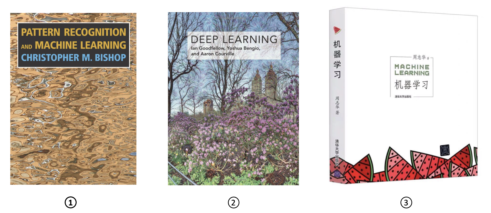

# 深入理解 Pattern Recognition and Machine Learning

## 项目简介
&emsp;&emsp;本项目是作者以 Bishop 的《Pattern Recognition and Machine Learning》为主，其他机器学习相关资料为辅，按照自己的学习路线，对模式识别和机器学习知识点做出的系统性总结概括，也是基于我个人理解对 PRML 导读性的学习笔记和教程。

&emsp;&emsp;作者本人是一名在读博士研究生，研究方向为自然语言语音的处理，本科期间就对机器学习相关领域的研究神往已久，后来机缘巧合下选择了语言模型，语音识别等作为博士研究课题。我坚持认为对机器学习基础知识的掌握决定了个人的科研成就上限，正所谓水之积也不厚，则其负大舟也无力。
于是我选择了有着机器学习领域圣经之称的 Bishop 的《Pattern Recognition and Machine Learning》，作为主要学习参考资料，并在知乎长期进行学习笔记的专栏写作。
后来了解到 Datawhale，发现组织的开源思想与自己不谋而合，逐渐萌生了把这些笔记整理并完善成为一个开源项目的想法。

&emsp;&emsp;PRML 阅读难度较大，令很多有志于从事机器学习工作研究的伙伴望而却步。本项目取名 Dive into PRML，旨在以一个初学者的角度，深入浅出，在宏观的知识体系基础上，再行深入探讨细节难点，把我在学习这本书及其他机器学习知识的心路历程和笔记总结分享给大家，与更多志同道合的伙伴交流进步。
项目先以 PRML 导读性教程的形式呈现，而后精益求精，结合其他资料融会贯通，最终希望能自成一家，止于至善，作为我博士生涯的一项重要成果而收官。
行远自迩，笃行不怠，希望自己能把这份初心躬行到底，也希望能为中国开源事业贡献绵薄之力。

## 参考目录

* **前言 Preface**
    * [写作初衷 Original Intention](./preface/intention.md)
    * [预期目标 Expected Targets](./preface/experience.md)

* **基础篇 Basis**
    * [1 线性回归 Linear Regression](./ch1_linear_regression/README.md)
        * [1.1 多项式拟合 Polynomial Fitting](./ch1_linear_regression/1.1_polynomial_fitting.md)
        * [1.2 线性基函数模型 Linear Basis Function Model](./ch1_linear_regression/1.2_linear_basis_function_model.md)
        * [1.3 最大似然估计 Maximum Likelihoood Estimation](./ch1_linear_regression/1.3_maximum_likelihoood_estimation.md)
        * [1.4 最小均方差 Minimum Square Error](./ch1_linear_regression/1.4_minimum_square_error.md)
        * [1.5 梯度下降法 Gradient Desent](./ch1_linear_regression/1.5_gradient_desent.md)
        * [1.6 解析法 Analytic Method](./ch1_linear_regression/1.6_analytic_method.md)
    * [2 线性分类 Linear Classification](./ch2_linear_classification/README.md)
        * [2.1 线性判别分析 Linear Discriminate Analysis](./ch2_linear_classification/2.1_linear_discriminate_analysis.md)
        * [2.2 Fisher分类器 Fisher Classifier](./ch2_linear_classification/2.2_fisher_classifier.md)
        * [2.3 感知器算法 Perceptron Algorithm](./ch2_linear_classification/2.3_perceptron_algorithm.md)
        * [2.4 判别式 Logistic 回归 Discrminate Logistic Regression](./ch2_linear_classification/2.4_discriminate_logistic_regression.md)
        * [2.5 生成式 Logistic 回归 Generative Logistic Regression](./ch2_linear_classification/2.5_generative_logistic_regression.md)
        * [2.6 广义线性模型 Generalized Linear Model](./ch2_linear_classification/2.6_generalized_linear_model.md)
    * [3 学习理论 Learning Theory](./ch3_learning_theory/README.md)
        * [3.1 过拟合 Overfitting](./ch3_learning_theory/3.1_overfitting.md)
        * [3.2 正则化 Regularization](./ch3_learning_theory/3.2_regularization.md)
        * [3.3 模型特征选择 Model Feature Selection](./ch3_learning_theory/3.3_mode_feature_selection.md)
        * [3.4 偏差与方差 Bias and Variance](./ch3_learning_theory/3.4_bias_and_variance.md)
    * [4 信息论 Information Theory](./ch4_information_theory/README.md)
        * [4.1 信息熵 Information Entropy](./ch4_information_theory/4.1_information_entropy.md)
        * [4.2 熵的物理意义 Entropy in Physics](./ch4_information_theory/4.2_entropy_in_physics.md)
        * [4.3 相对熵 Relative Entropy](./ch4_information_theory/4.3_relative_entropy.md)
        * [4.4 互信息 Mutual Information](./ch4_information_theory/4.4_mutual_information.md)
    * [5 概率分布 Probability Distribution](./ch5_probability_distribution/README.md)
        * [5.1 贝叶斯概率 Bayes Probability](./ch5_probability_distribution/5.1_bayes_probability.md)
        * [5.2 Beta分布 Beta Distribution](./ch5_probability_distribution/5.2_beta_distribution.md)
        * [5.3 狄利克雷分布 Dirichlet Distribution](./ch5_probability_distribution/5.3_dirichlet_distribution.md)
        * [5.4 高斯分布 Gaussian Distribution](./ch5_probability_distribution/5.4_gaussian_distribution.md)

* **进阶篇 Advance**
    * [6 神经网络 Neural Networks](./ch6_neural_networks/README.md)
    * [7 核方法 Kernel Method](./ch7_kernel_method/README.md)
    * [8 支持向量机 Support Vector Machine](./ch8_support_vector_machine/README.md)
    * [9 期望最大化算法 EM Algorithm](./ch9_em_algorithm/README.md)
    * [10 变分推断 Variational Inference](./ch10_variational_inference/README.md)
    * [11 蒙特卡罗采样 Monte Carlo Sampling](./ch11_monte_carlo_sampling/README.md)
    * [12 主成分分析 Principal Component Analysis](./ch12_principal_component_analysis/README.md)
    * [13 隐马尔科夫模型 Hidden Markov Model](./ch13_hidden_markov_model/README.md)
    * [14 主题模型 Topic Models](./ch14_topic_models/README.md)
    * [15 强化学习 Reinforcement Learning](./ch15_reinforcement_learning/README.md)
    * [16 图模型 Graph Models](./ch16_graph_model/README.md)
    * [17 生成模型 Generative Model](./ch17_generative_model/README.md)

## 参考资料

&emsp;&emsp;项目主要以 PRML 为根据，但由于该书成书较久，很多知识点近年的发展未能充分涵盖，尤其是在一些机器学习模型基础上发展的深度学习模型，因此我也参考了 Bengio《Deep Learning》花书以及周志华老师《机器学习》西瓜书的相关部分作为扩充，引入近些年炙手可热的深度学习方法，为 PRML 注入一些新鲜血液。

> **① Pattern Recognition and Machine Learning &emsp; 作者：Christopher M. Bishop**  
> ② Deep Learning &emsp; 作者：Ian Goodfellow, Yoshua Bengio, Aaron Courville    
> ③ 机器学习 &emsp; 作者：周志华  

<!-- ## 主要贡献者
[@薛博阳-Nocturne](https://github.com/Relph1119)   -->

## 贡献名单

<table align="center" style="width:90%;">
<thead>
  <tr>
    <th>成员</th>
    <th>简介</th>
  </tr>
</thead>
<tbody>
  <tr>
    <td><a href="https://amourwaltz.github.io">薛博阳</a></td>
    <td>项目负责人，香港中文大学博士在读 </td>
  </tr>
</tbody>
</table>

## 关注我们

扫描下方二维码关注公众号：Datawhale

&emsp;&emsp;Datawhale，一个专注于AI领域的学习圈子。初衷是 for the learner，和学习者一起成长。目前加入学习社群的人数已经数千人，组织了机器学习，深度学习，数据分析，数据挖掘，爬虫，编程，统计学，Mysql，数据竞赛等多个领域的内容学习，微信搜索公众号Datawhale可以加入我们。

## LICENSE
 本作品采用<a rel="license" href="http://creativecommons.org/licenses/by-nc-sa/4.0/">知识共享署名-非商业性使用-相同方式共享 4.0 国际许可协议</a>进行许可。