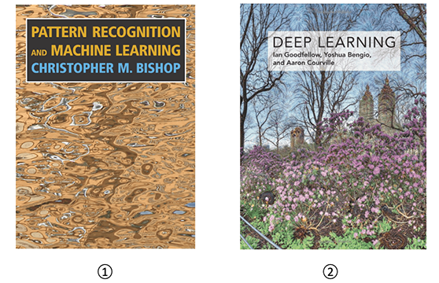

# 深入理解 PRML & Deep Learning
 

&emsp;&emsp;本项目是基于 Bishop 的《Pattern Recognition and Machine Learning》（以下简称 PRML）和深度学习花书《Deep Learning》的学习笔记和导读教程，也是作者学习过程中对机器学习和深度学习作出的系统性总结资料。

&emsp;&emsp;机器学习是当下最热门的方向之一，很多从事相关工作研究的伙伴都希望能在该领域更进一步，而对基础知识的掌握程度往往决定了个人能企及的成就上限，正所谓水之积也不厚，则其负大舟也无力。于是我选择了素有机器学习和深度学习领域“圣经”之称的 PRML 和 Deep Learning 作为主要资料，并坚持进行学习笔记的写作整理，后来逐渐决定做一个基于 ML&DL 的开源项目。
本项目取名 Dive into ML&DL，以一个初学者的角度，深入浅出，构建系统性的知识框架。一方面 PRML 毫无疑问是一本值得深究的经典之作；另一方面，本项目也不局限于 PRML 和 DL 这两本书，会引入一些近年来相关的方法作补充，努力打造一个新的机器学习教程。

&emsp;&emsp;项目计划分为试行版，完整版，发行版三个版本，具体可参见[项目实施](./preface/experience.md)，先以 PRML 和 DL 学习笔记的形式呈现，而后精益求精，结合其他资料融会贯通，自成体系，做出一份完整的教程，作为我学术生涯的一项重要成果而收官。
行远自迩，笃行不怠，希望自己能把这份初心坚持到底，有所建树，同时也能为中国开源事业贡献绵薄之力。

## 参考目录

* **前言 Preface**
    * [写作初衷 Original Intention](./preface/intention.md)
    * [项目实施 Project Implementation](./preface/experience.md)

* **机器学习篇 Machine Learning**
    * [1 线性回归 Linear Regression](./ch1_linear_regression/README.md)
        * [1.1 线性基函数模型 Linear Basis Function Model](./ch1_linear_regression/1.1_linear_basis_function_model.md)  
        * [1.2 最大似然估计 Maximum Likelihoood Estimation](./ch1_linear_regression/1.2_maximum_likelihoood_estimation.md)  
        * [1.3 最小均方差 Minimum Square Error](./ch1_linear_regression/1.3_minimum_square_error.md)  
        * [1.4 梯度下降法 Gradient Desent](./ch1_linear_regression/1.4_gradient_desent.md)  
        * [1.5 解析法 Analytic Method](./ch1_linear_regression/1.5_analytic_method.md)  
    * [2 线性分类 Linear Classification](./ch2_linear_classification/README.md)
        * [2.1 线性判别分析 Linear Discriminate Analysis](./ch2_linear_classification/2.1_linear_discriminate_analysis.md)  
        * [2.2 Fisher分类器 Fisher Classifier](./ch2_linear_classification/2.2_fisher_classifier.md)  
        * [2.3 感知器算法 Perceptron Algorithm](./ch2_linear_classification/2.3_perceptron_algorithm.md)  
        * [2.4 判别式 Logistic 回归 Discrminate Logistic Regression](./ch2_linear_classification/2.4_discriminate_logistic_regression.md)  
        * [2.5 生成式 Logistic 回归 Generative Logistic Regression](./ch2_linear_classification/2.5_generative_logistic_regression.md)  
        * [2.6 广义线性模型 Generalized Linear Model](./ch2_linear_classification/2.6_generalized_linear_model.md)  
    * [3 概率分布 Probability Distribution](./ch5_probability_distribution/README.md)
        * [3.1 贝叶斯概率 Bayes Probability](./ch5_probability_distribution/5.1_bayes_probability.md)
        * [3.2 Beta分布 Beta Distribution](./ch5_probability_distribution/5.2_beta_distribution.md)
        * [3.3 狄利克雷分布 Dirichlet Distribution](./ch5_probability_distribution/5.3_dirichlet_distribution.md)
        * [3.4 高斯分布 Gaussian Distribution](./ch5_probability_distribution/5.4_gaussian_distribution.md)
    * [4 神经网络 Neural Networks](./ch6_neural_networks/README.md)
    * [5 核方法 Kernel Method](./ch7_kernel_method/README.md)
    * [6 支持向量机 Support Vector Machine](./ch8_support_vector_machine/README.md)
    * [7 图模型 Graph Models](./ch9_graph_model/README.md)
    * [8 期望最大化算法 EM Algorithm](./ch10_em_algorithm/README.md)
    * [9 变分推断 Variational Inference](./ch11_variational_inference/README.md)
    * [10 蒙特卡罗采样 Monte Carlo Sampling](./ch12_monte_carlo_sampling/README.md)
    * [11 主成分分析 Principal Component Analysis](./ch13_principal_component_analysis/README.md)
    * [12 隐马尔科夫模型 Hidden Markov Model](./ch14_hidden_markov_model/README.md)
  
* **深度学习篇 Deep Learning**
    * [1 学习理论 Learning Theory](./ch3_learning_theory/README.md)
        * [1.1 过拟合 Overfitting](./ch3_learning_theory/3.1_overfitting.md)
        * [1.2 正则化 Regularization](./ch3_learning_theory/3.2_regularization.md)
        * [1.3 模型特征选择 Model Feature Selection](./ch3_learning_theory/3.3_mode_feature_selection.md)
        * [1.4 偏差与方差 Bias and Variance](./ch3_learning_theory/3.4_bias_and_variance.md)
    * [2 信息论 Information Theory](./ch4_information_theory/README.md)
        * [2.1 信息熵 Information Entropy](./ch4_information_theory/4.1_information_entropy.md)
        * [2.2 熵的物理意义 Entropy in Physics](./ch4_information_theory/4.2_entropy_in_physics.md)
        * [2.3 相对熵 Relative Entropy](./ch4_information_theory/4.3_relative_entropy.md)
        * [2.4 互信息 Mutual Information](./ch4_information_theory/4.4_mutual_information.md)

## 参考资料

 

> **① Pattern Recognition and Machine Learning &emsp; 作者：Christopher M. Bishop**  
> **② Deep Learning &emsp; 作者：Ian Goodfellow, Yoshua Bengio, Aaron Courville**    

<!-- ## 主要贡献者
[@薛博阳-Nocturne](https://github.com/Relph1119)   -->

## 贡献名单

 

<table align="center" style="width:90%;">
<thead>
  <tr>
    <th>成员</th>
    <th>简介</th>
    <th>主页</th>
  </tr>
</thead>
<tbody>
  <tr>
    <td><a href="https://amourwaltz.github.io">薛博阳</a></td>
    <td>项目负责人，香港中文大学博士在读 </td>
    <td><a href="https://github.com/AmourWaltz">Github</a>, <a href="https://www.zhihu.com/people/yi-ran-chao-shi-dai">知乎</a> </td>
  </tr>
</tbody>
</table>

&emsp;&emsp;由于项目规划工程量较大，时间线预计较久，我平日精力能力有限，非常期望能遇到对此项目以及 PRML 感兴趣或者正在学习的伙伴，希望你能参与部分章节的编辑，或对完成的内容进行检查斧正，或对项目提出合理建议，有意者欢迎联系。

## 关注我们

扫描下方二维码关注公众号：Datawhale

&emsp;&emsp;Datawhale，一个专注于AI领域的学习圈子。初衷是 for the learner，和学习者一起成长。目前加入学习社群的人数已经数千人，组织了机器学习，深度学习，数据分析，数据挖掘，爬虫，编程，统计学，Mysql，数据竞赛等多个领域的内容学习，微信搜索公众号Datawhale可以加入我们。

## LICENSE
 本作品采用<a rel="license" href="http://creativecommons.org/licenses/by-nc-sa/4.0/">知识共享署名-非商业性使用-相同方式共享 4.0 国际许可协议</a>进行许可。